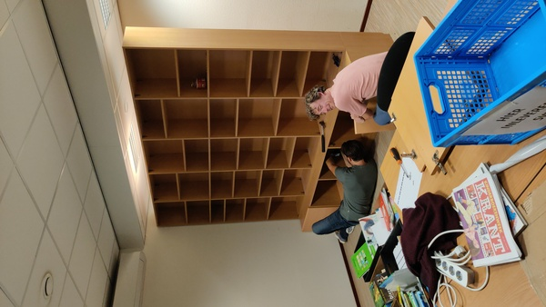

Binnenkort gaan we open! Nu al sneaken er elke ochtend leesgierige kinderen de bieb in om een boek dat ze niet zo leuk vonden te ruilen of een nieuw boek te halen dat lijkt op het vorige boek dat ze in een ruk uitgelezen hebben. En dat terwijl er overal nog dozen staan met boeken die nog netjes gestikkerd en op alfabet gezet moeten worden.

Maar we zijn er bijna klaar voor, en we hebben hulp nodig om de bibliotheek te bemensen!

---
Elke ochtend tijdens het stillezen en aan het eind van elke schooldag opent de bibliotheek haar deuren en kunnen kinderen die een boek uit hebben het komen ruilen. De kinderen kunnen 2 boeken lenen: een voor op school en een om lekker thuis te lezen.

Om de kinderen in hun boekenkeuze te helpen en om alle boeken netjes te registreren zodat we weten wie wat leest en waar onze boeken zijn, hebben we bibliothecarissen nodig.

<figure style="float:left; margin-left: 0px; margin-right:15px;">

<figcaption>Voorbeeldvrijwilligers</figcaption>
</figure>Dat kunnen ouders zijn, maar ook opa's & oma's, buren. Mensen die het leuk vinden om kinderen te begeleiden in hun weg door boekenland.

Vrijwilliger zijn betekend precies dat, er zijn geen verplichtingen, je hoeft je niet voor een vast tijd of een vaste periode te vast te leggen. Alle hulp is welkom. 

Dus, meld je aan [online](https://docs.google.com/forms/d/e/1FAIpQLSdkGrHVsDoCVC3BJPbBbqS0-X_zy7xs-wfokwUBZDGVk-E5Tg/viewform), via onze email, bieb@simama.net of spreek ons aan op het schoolplein.

