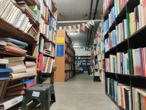

Waar haal je genoeg boeken vandaan om een hele bibliotheek mee te vullen? Gelukkig heeft de Bernard Lievegoedschool al heel veel boeken, verspreid over alle klassen. Maar nog lang niet genoeg om op elk moment het juiste boek voor elke leerling in huis te hebben. Of misschien wel twee, zodat je er ook een mee naar huis kan nemen.

---

Onze inzamelingsactie heeft al veel opgeleverd aan mooie boeken. En met een subsidie van het Bibliotheek op School project kunnen we binnenkort ook een set nieuwe boeken aanschaffen.

Begin Juni zijn we namens de school naar de [Boekenkelder](https://boekenvoormensen.nl/de-kelder/) geweest. Als je nog nooit in de Boekenkelder geweest bent, stel je een ondergronds labyrinth voor waar je kunt verdwalen tussen rijen en rijen rekken, gevuld met maar liefst 150.000 boeken. Af en toe kom je een vrijwilliger tegen die druk is met het uitpakken en categoriseren van stapels dozen met nog meer boeken. Voor de liefhebber, een paradijs!

Boeken gaan voor een prikkie van de hand en je kunt met goed zoeken echt pareltjes vinden.

We werden met open armen ontvangen door Lizzy, die samen met Trees de jeugd-afdeling bestiert. Lizzy steunt vaker scholen, en ze was heel blij met ons plan. Als eerste konden we haar helpen met het legen van haar opslag en zoveel mogelijk van haar dubbele boeken meenemen. Nou, dat hoefde ze geen twee keer te vragen en met 6 bananendozen aan boeken gingen wij weer schoolwaarts.

Binnenkort organiseren we een uitstapje met de docenten zodat zij op zoek kunnen naar boeken die aansluiten bij het [periode-onderwijs](/periode.html) dat ze komend schooljaar gaan onderwijzen.

Volgende station: Kasten!
