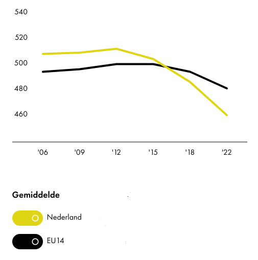

# Waarom

De leesvaardigheid op de Bernard Lievegoedschool voldoet aan het Nederlandse gemiddelde.

Echter, in heel Europa gaat op het moment de leesvaardigheid achteruit. En in Nederland nog iets sneller.

Reden genoeg dus om extra ons best te doen om kinderen zo veel en zo goed mogelijk te laten lezen.

Als ouders kunnen we daar ons steentje aan bijdragen. En dit is ons eerste steentje.

## Leesvaardigheid (voor 15 jarigen)

Wil je meer weten over leesonderwijs en initiatieven om het te verbeteren, lees dan onze [bronnen](bronnen) pagina.